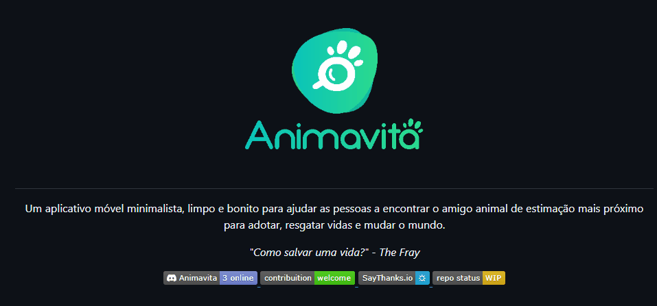

# Projeto com README
Um projeto de teste com um arquivo README 💻💻🚀🚀

[]

## tecnologias utilizadas
- HTML
- CSS
- JS

## como utilizar

1 - Projeto
```
git clone
```

2 - Acessa a pasta do projeto
```
cd repositorio-com-readme
```
